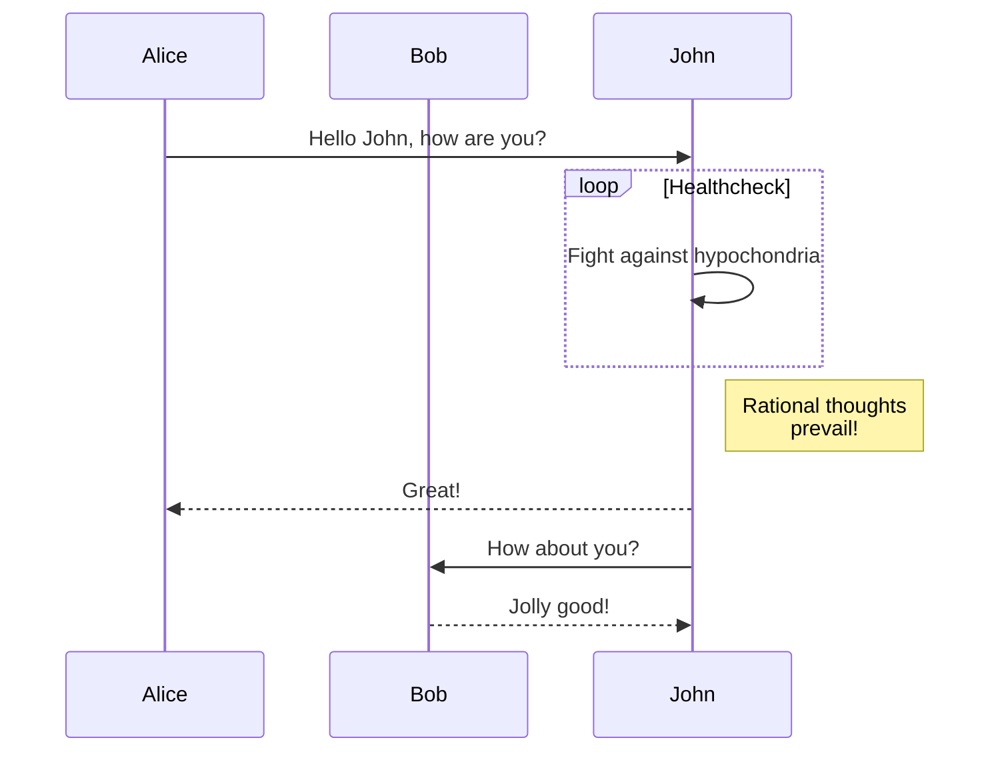

---
# ーーーーーーーーーーーーーーーーーーーーーーーーー表示内容ーーーーーーーーーーーーーーーーーーーーーーーーー
title: "Mermaid Test" #　タイトル

author: ["JOJO"] # 作者

date: 2023-05-04T21:33:36+09:00 # 作成日付
ShowReadingTime: true #　閲覧予測時間

tags: ["Hugo", "Mermaid", "UML"]
weight: # 表示順番
draft: false # 下書き
# ーーーーーーーーーーーーーーーーーーーーーーーーー設定ーーーーーーーーーーーーーーーーーーーーーーーーー
# aliases: ["/first"]
ShowToc: true # 目次
TocOpen: true # 目次の自動展開
hidemeta: false # ブログメッセージの表示
comments: true #　コメント
description: "「追いかけ続ける勇気さえあれば、夢は必ず叶います」"
canonicalURL: "https://zhangpeng-system.github.io/blog/"
disableHLJS: true # to disable highlightjs
disableShare: false # Fooderのシェアボタンの表示
disableHLJS: false
hideSummary: false
searchHidden: false # 検索可能
showbreadcrumbs: true #　目次のパス表示
ShowPostNavLinks: true
ShowWordCount: true
ShowRssButtonInSectionTermList: true
UseHugoToc: true

cover:
    image: "" # 画像パス：posts/tech/ブログファイル同名フォルダ/picture.png
    alt: "" # 画像説明
    caption: "" # 画像説明(画像下部)
    relative: false # when using page bundles set this to true
    # hidden: true # only hide on current single page

---
# This is a test for UML.
## pre記法
<pre class="mermaid">
  graph LR
      A --- B
      B-->C[fa:fa-ban forbidden]
      B-->D(fa:fa-spinner);
</pre>
## div記法

  graph LR
      A --- B
      B-->C[fa:fa-ban forbidden]
      B-->D(fa:fa-spinner);

## markdown記法

## Hugo記法

sequenceDiagram
    Client->>Cache: search cache
    Cache-->>Client: cache
    Client->>Repo: fetch data
    Repo-->>Client: data
